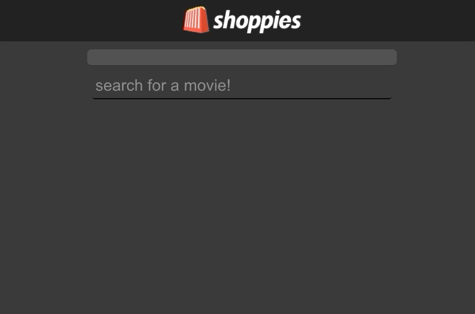

## Hello!

This app is to accompany my Winter 2021 Application for Shopify!  
Please take a look at my submission [here](https://the-shoppies-winter-2021.netlify.app) 

[Known Issues](#known-issues)

---

## Images and Screenshots

### Shoppies Logo
I hope the marketing department doesn't mind... 🍿🛍

  

 

### Searching
I used debouncing to limit API calls 👸

  

### Nominating
Nominating a movie adds its poster to the top of the page 🎥

  

---
### What I'm Proud of
- Going outside of my comfort zone and working with react, something I'm still learning a lot about. I found it challenging in Bootcamp and wanted to challenge myself further.
- The logo and the styling (given the time)
- Deploying my first solo app, first time using netlify
- Not giving up when the going got tough, there was a lot I didn't know that I didn't know!
- Styling it myself without the help of a framework
- Using debouncing
- Even though I didn't quite finish everything that I wanted to, I'm proud of what I was able to accomplish in a day's time. There was a lot of visual flair I wanted to add!

### What I Learned
- Following a tutorial a couple weeks ago won't necessarily help when doing it from scratch on your own
  - First time making a react app on my own
  - Kicked my butt
- It's important to consider making a back end when dealing with APIs
  - Spent a long time trying to figure out how to hide my key
  - Luckily for me this is just a free API key that's accessible to anybody
- Take however long you think it will take and then double it...

### Technology
- Made with [Create React App](https://github.com/facebook/create-react-app)
- Used [OMDb API](http://www.omdbapi.com/)

### Known Issues
- No backend to use to hide the OMDB API key (visible in network requests when deployed, but not visible in the github repo) 
- Button styling is poor, poor placement as well
- nominations container formats poorly when wide enough

---

## Available Scripts

In the project directory, you can run:

### `npm start`

Runs the app in the development mode. 
Open [http://localhost:3000](http://localhost:3000) to view it in the browser.